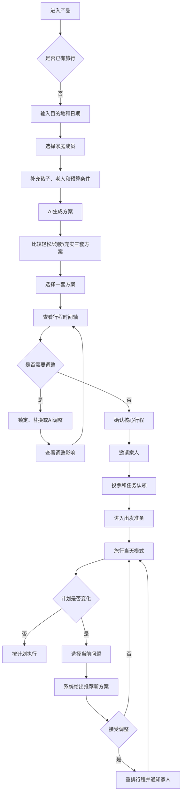
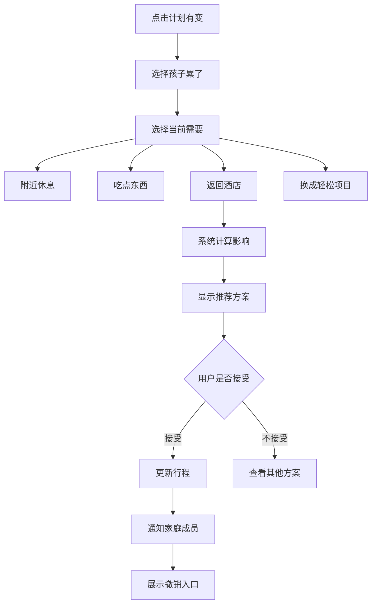

下面是一份可以直接交给设计师的《亲子旅行规划产品概念原型设计需求文档》。目标不是描述完整技术实现，而是让设计师清楚：

- 为谁设计；
- 用户在什么场景下使用；
- 要设计哪些页面；
- 页面上有什么；
- 用户点击后发生什么；
- 正常、空、错、加载等状态如何表现；
- 最终需要交付什么。

---

# 亲子旅行管家概念原型设计需求文档

## 0. 文档信息

| 项目 | 内容 |
|---|---|
| 项目名称 | 亲子旅行管家 |
| 文档版本 | V1.0 |
| 设计阶段 | 产品概念原型 |
| 设计目标 | 验证核心交互和用户流程，不要求完成最终视觉设计 |
| 首发终端 | 移动端，优先按微信小程序设计 |
| 设计基准尺寸 | 375×812 px，可兼容主流手机 |
| 原型工具 | Figma、Sketch、MasterGo或即时设计 |
| 原型保真度 | 中保真，重点表现信息结构、状态和交互 |
| 主要评审对象 | 产品、业务、设计、潜在用户 |
| 本轮是否涉及开发标注 | 否 |
| 本轮是否需要完整设计系统 | 否，仅需基础组件规范 |
| 计划交付物 | 页面原型、可点击原型、用户流程图、关键交互说明 |

---

# 一、项目背景

## 1.1 一句话介绍

为亲子家庭提供一款可以根据**孩子年龄、作息、家庭成员、预算和实时状态**生成并动态调整旅行行程的家庭旅行规划工具。

## 1.2 当前用户问题

亲子旅行的主要规划者通常需要独自完成：

- 搜集攻略；
- 筛选景点；
- 计算路线；
- 检查儿童票规则；
- 安排孩子午睡和用餐；
- 照顾老人；
- 预订酒店、门票和交通；
- 准备证件与行李；
- 通知同行家人；
- 处理天气、排队和孩子疲惫等临时变化。

现有产品往往提供大量内容，但无法将信息自动转化成“适合这个家庭、可以直接执行”的行程。

## 1.3 产品核心价值

用户不是为了得到一篇攻略，而是为了：

1. 少搜索；
2. 少做决定；
3. 少担心遗漏；
4. 让家人共同承担；
5. 出现变化时能快速解决。

## 1.4 产品核心承诺

> 10分钟生成一份考虑孩子作息、全家体力和预算，并可随时调整的家庭旅行方案。

---

# 二、目标与非目标

## 2.1 本轮概念原型目标

本轮设计主要验证以下五个闭环：

### 闭环一：快速表达家庭需求

用户无需填写复杂表单，即可告诉系统：

- 去哪里；
- 什么时间；
- 有哪些家庭成员；
- 孩子多大；
- 有什么特殊需求；
- 预算是多少。

### 闭环二：获得可比较的家庭行程

系统提供轻松、均衡、充实三套方案，并说明：

- 每日步数；
- 转场次数；
- 午休保障；
- 预计预算；
- 对孩子和老人的适配程度。

### 闭环三：编辑并确认行程

用户可以：

- 锁定必去项目；
- 替换景点；
- 调整行程强度；
- 查看调整影响；
- 接受或撤销修改。

### 闭环四：家庭协作

主规划者可以邀请家人：

- 查看行程；
- 投票；
- 认领任务；
- 接收行程变化。

### 闭环五：行中动态调整

旅行中出现以下情况时，用户可以快速获得新方案：

- 孩子累了；
- 下雨了；
- 天气太热；
- 排队太久；
- 行程迟到；
- 老人走不动。

## 2.2 本轮不做

以下内容不需要在本轮概念原型中完整设计：

- 完整酒店预订和支付；
- 完整机票、火车票购买；
- 社区内容信息流；
- 商家后台；
- 复杂会员体系；
- 在线客服系统；
- 真实导航地图；
- 实时定位技术；
- 完整医疗问诊；
- 多语言版本；
- 平板、车机和手表版本。

可以保留入口，但不展开完整流程。

---

# 三、目标用户

## 3.1 核心用户画像

### 林女士：家庭旅行主规划者

| 属性 | 描述 |
|---|---|
| 年龄 | 35岁 |
| 城市 | 上海 |
| 家庭情况 | 丈夫、5岁孩子、父母 |
| 使用习惯 | 经常使用微信、小红书、携程和地图 |
| 旅行频率 | 每年2—4次家庭旅行 |
| 角色 | 负责目的地、酒店、门票、攻略和行李准备 |
| 核心目标 | 全家都能玩好，但不要太累 |
| 核心焦虑 | 怕漏订、怕行程不合理、怕孩子和老人临时出问题 |
| 产品期待 | 直接告诉我怎么安排，并在计划变化时替我处理 |

## 3.2 次要用户

### 爸爸或伴侣

- 查看日程；
- 负责值机、交通、导航和证件；
- 希望界面简单，不需要了解全部规划逻辑。

### 老人

- 关注几点出发、走多少路、在哪里休息；
- 需要较大字体和清楚的时间安排；
- 不需要看到复杂预算和编辑功能。

### 儿童

- 通过图片、倒计时和探险任务了解行程；
- 不可访问支付、健康和隐私信息；
- 本轮仅保留儿童模式概念入口。

---

# 四、核心使用场景

本轮概念原型统一使用以下案例，以保证页面数据一致。

## 4.1 示例旅行

| 项目 | 示例内容 |
|---|---|
| 目的地 | 北京 |
| 出发地 | 上海 |
| 日期 | 7月18日—7月22日 |
| 旅行天数 | 5天4晚 |
| 家庭成员 | 2位成人、1位5岁儿童、2位老人 |
| 孩子情况 | 每天13:00左右需要午休 |
| 老人情况 | 膝盖不适，不适合长时间步行和爬坡 |
| 家庭兴趣 | 历史、自然、儿童互动体验、美食 |
| 旅行节奏 | 均衡偏轻松 |
| 预算 | 18,000元 |
| 必去项目 | 故宫、自然博物馆 |
| 特殊要求 | 不频繁换酒店、尽量不早于8:00出发 |
| 临时事件 | 第3天下午高温，孩子疲惫，需要调整行程 |

## 4.2 用户故事

> 作为一位家庭旅行主规划者，我希望只需输入目的地、时间、成员和预算，就可以获得一份考虑孩子午睡和老人步行能力的行程；我可以让家人参与确认和分工，旅行过程中如果孩子累了或天气变化，也能一键重新安排。

---

# 五、体验目标与设计原则

## 5.1 用户理想心理变化

> 焦虑 → 被理解 → 获得确定感 → 掌控方案 → 分担责任 → 安心出发 → 从容执行 → 意外被解决。

## 5.2 设计原则

### 原则一：每个页面只突出一个主要任务

例如：

- 创建阶段：继续回答问题；
- 方案阶段：选择旅行节奏；
- 准备阶段：完成最重要的待办；
- 行中阶段：查看下一步；
- 变化阶段：接受新方案。

### 原则二：结构化操作为主，AI对话为辅

按钮、卡片和时间轴负责：

- 选择；
- 确认；
- 删除；
- 调整；
- 查看票券；
- 分配任务。

AI对话负责：

- 理解模糊需求；
- 解释推荐原因；
- 综合调整多个条件；
- 处理自然语言和截图。

### 原则三：先展示结论，再提供细节

用户首先需要知道：

- 推荐什么；
- 为什么；
- 对预算和体力有什么影响；
- 下一步要做什么。

长篇介绍放在二级页面。

### 原则四：自动调整必须可解释、可撤销

任何AI调整都需要告诉用户：

- 改了什么；
- 为什么改；
- 预算如何变化；
- 步行量如何变化；
- 哪些订单和预约受影响；
- 如何撤销。

### 原则五：旅行中减少手机操作

旅行中页面应：

- 字体更大；
- 信息更少；
- 主按钮更明显；
- 单手可以完成；
- 不出现无关内容和广告。

---

# 六、信息架构

```text
亲子旅行管家
├── 旅程
│   ├── 创建旅行
│   ├── 方案选择
│   ├── 行程时间轴
│   ├── 地点详情
│   ├── AI调整
│   ├── 出发准备
│   ├── 今天的行程
│   └── 计划有变
├── 地图
│   ├── 行程路线
│   ├── 厕所
│   ├── 母婴室
│   ├── 休息点
│   ├── 餐厅
│   ├── 药店
│   └── 医疗资源
├── 家庭
│   ├── 家庭成员
│   ├── 家庭投票
│   ├── 任务分工
│   └── 家庭通知
└── 我的
    ├── 家庭档案
    ├── 订单与票券
    ├── 预算
    ├── 历史旅行
    └── 隐私设置
```

---

# 七、全局导航

## 7.1 底部导航

设计四个一级入口：

1. **旅程**
2. **地图**
3. **家庭**
4. **我的**

## 7.2 全局AI入口

页面右下方设置“问管家”悬浮按钮。

点击后打开底部面板，支持：

- 文字输入；
- 语音输入；
- 上传截图；
- 快捷问题。

示例快捷问题：

- 把明天安排得轻松一点；
- 孩子累了；
- 换一个室内项目；
- 这个地方适合5岁孩子吗？
- 预算降低10%。

## 7.3 首页状态切换

“旅程”首页根据阶段自动变化：

| 用户阶段 | 首页重点 |
|---|---|
| 未创建旅行 | 开始规划 |
| 规划中 | 方案和待确认事项 |
| 出发前 | 准备度和待办事项 |
| 旅行中 | 下一站和即时操作 |
| 旅行后 | 回顾和家庭偏好沉淀 |

本轮至少设计前四种状态。

---

# 八、核心用户流程

## 8.1 主流程



## 8.2 “孩子累了”异常流程



---

# 九、页面清单与优先级

使用MoSCoW确定本轮范围。

## 9.1 Must Have：本轮必须设计

| 编号 | 页面 | 目的 |
|---|---|---|
| P01 | 未创建旅行首页 | 让用户快速开始规划 |
| P02 | 对话式创建旅行 | 收集基础旅行需求 |
| P03 | 家庭成员与特殊需求 | 收集孩子和老人约束 |
| P04 | AI生成进度 | 让用户理解系统正在做什么 |
| P05 | 三套方案选择 | 帮用户选择行程节奏 |
| P06 | 行程时间轴 | 查看和编辑完整行程 |
| P07 | 地点详情 | 查看亲子适配信息 |
| P08 | AI调整面板 | 修改行程 |
| P09 | 调整前后对比 | 确认调整及其影响 |
| P10 | 家庭协作 | 邀请、投票和分工 |
| P11 | 出发准备首页 | 查看待办、天气和行李 |
| P12 | 旅行当天首页 | 查看现在应该做什么 |
| P13 | 计划有变 | 选择突发状态 |
| P14 | 动态重排结果 | 接受新方案并通知家人 |

## 9.2 Should Have：建议设计

| 编号 | 页面 |
|---|---|
| P15 | 亲子设施地图 |
| P16 | 订单与预算 |
| P17 | 有人不舒服的安全模式 |
| P18 | 家人访问的简化页面 |
| P19 | 空状态、错误状态和断网状态 |

## 9.3 Could Have：有时间再做

- 儿童探险模式；
- 行后旅行回顾；
- 旅行照片书；
- 祖孙三代专属模式；
- 多家庭费用分摊。

## 9.4 Won’t Have：本轮明确不做

- 完整支付；
- 社区信息流；
- 商家入驻；
- 直播和短视频；
- 复杂积分商城。

---

# 十、页面详细需求

---

## P01：未创建旅行首页

### 1. 页面目标

让首次进入的用户在30秒内理解产品价值，并开始创建旅行。

### 2. 页面布局

从上到下：

1. 顶部问候语；
2. 核心价值文案；
3. 目的地输入框；
4. 两个主要入口；
5. 快捷场景；
6. 历史家庭档案或示例；
7. 底部导航。

### 3. 页面元素

#### 主标题

> 带谁、去哪、玩几天，生成一份全家走得动的行程。

#### 目的地输入框

占位文案：

> 输入目的地，或告诉我想怎么玩

支持：

- 键盘输入；
- 语音；
- 推荐目的地联想。

#### 主按钮

- 我已经知道去哪；
- 还没决定，帮我选。

#### 快捷场景

- 暑期避暑；
- 亲子研学；
- 祖孙三代；
- 乐园之旅；
- 第一次带娃出境。

### 4. 交互逻辑

- 点击输入框：进入P02；
- 点击“我已经知道去哪”：进入P02并聚焦目的地；
- 点击“还没决定”：进入目的地推荐流程，本轮可以用简单弹层表现；
- 点击快捷场景：带入场景标签后进入P02；
- 首次进入不强制登录。

### 5. 页面状态

- 默认态；
- 已有家庭档案；
- 有未完成旅行；
- 无网络；
- 目的地联想加载失败。

---

## P02：对话式创建旅行

### 1. 页面目标

用最少问题收集能够生成初版行程的信息。

### 2. 页面布局

- 顶部：返回、标题“创建旅行”、保存退出；
- 中部：AI问答区域；
- 底部：文字/语音输入区；
- 选择题使用卡片、日期选择器和人数步进器。

### 3. 必填信息

| 字段 | 控件 | 默认状态 | 校验 |
|---|---|---|---|
| 目的地 | 搜索输入 | 空 | 必填 |
| 出发地 | 城市选择 | 可读取历史值 | 必填 |
| 日期 | 日期范围 | 空 | 必填 |
| 天数 | 自动计算 | 根据日期生成 | 不单独填写 |
| 成人数 | 步进器 | 2 | 至少1 |
| 儿童数 | 步进器 | 1 | 可为0，但无儿童时提示产品适用范围 |
| 老人数 | 步进器 | 0 | 可为0 |
| 预算 | 区间选择 | 未设置 | 可跳过 |

### 4. 推荐对话顺序

1. 这次想去哪里？
2. 什么时候出发，玩几天？
3. 从哪里出发？
4. 有哪些家庭成员同行？
5. 孩子多大？
6. 预算大约是多少？

### 5. 交互逻辑

- 用户每完成一步，自动进入下一题；
- 已回答内容以简洁摘要卡显示；
- 用户可点击摘要卡修改；
- 退出时自动保存草稿；
- 最后显示“继续了解家庭需求”。

### 6. 错误状态

- 日期早于当前日期；
- 未选择目的地；
- 结束日期早于开始日期；
- 目的地无法识别；
- 网络失败时允许保存草稿。

---

## P03：家庭成员与特殊需求

### 1. 页面目标

收集会显著影响行程的家庭约束，不做复杂健康问卷。

### 2. 儿童信息

需要设计：

- 年龄；
- 身高，可跳过；
- 是否午睡；
- 可接受连续步行时间；
- 兴趣标签；
- 过敏或忌口，可跳过。

### 3. 老人信息

需要设计：

- 正常步行；
- 不适合连续走1小时；
- 尽量少爬坡；
- 需要无障碍路线。

### 4. 家庭偏好

- 轻松；
- 均衡；
- 充实；
- 不早起；
- 不频繁换酒店；
- 尽量少排队；
- 酒店舒适优先；
- 预算优先。

### 5. 即时反馈

用户选择“孩子需要午睡”后显示：

> 已将每天13:00—15:00设为低强度时段。

选择“老人尽量少爬坡”后显示：

> 将优先推荐有电梯、少台阶和交通便利的路线。

### 6. 主操作

> 生成旅行方案

---

## P04：AI生成进度页

### 1. 页面目标

让等待过程可理解，同时强化“系统考虑了家庭条件”。

### 2. 页面内容

按顺序显示：

- 已理解家庭成员；
- 已匹配孩子作息；
- 正在检查老人友好路线；
- 正在计算交通与步行量；
- 正在检查预算；
- 正在准备高温和雨天备选。

### 3. 交互逻辑

- 已完成项显示勾选；
- 当前项显示轻量动效；
- 如果等待时间较长，先显示已完成的行程概览；
- 生成失败时保留用户输入，提供重新生成。

### 4. 禁止设计

- 只显示一个无限旋转的Loading；
- 使用“正在使用超级AI算法”等空泛描述；
- 插入酒店或门票广告。

---

## P05：三套方案选择页

### 1. 页面目标

帮助用户在轻松、均衡和充实之间作出选择。

### 2. 页面结构

顶部为三段切换：

- 轻松；
- 均衡·推荐；
- 充实。

核心指标：

| 指标 | 均衡版示例 |
|---|---|
| 核心体验 | 10个 |
| 日均步数 | 7,200步 |
| 日均转场 | 3次 |
| 午休保障 | 4天 |
| 老人友好 | 较高 |
| 排队风险 | 中低 |
| 预计预算 | 16,500—18,500元 |

### 3. 推荐理由

展示不超过4条：

- 孩子5岁且需要午睡；
- 老人不适合长距离步行；
- 用户选择文化与轻松体验；
- 预算在18,000元以内。

### 4. 交互逻辑

- 左右滑动或点击切换方案；
- 指标同步变化；
- 点击“查看每日安排”可预览；
- 点击“选择均衡版”进入P06；
- 用户仍可稍后切换方案。

---

## P06：行程时间轴

### 1. 页面目标

以可执行的时间轴展示每日行程，并允许用户编辑。

### 2. 页面布局

顶部：

- 旅行名称；
- 日期；
- 地图入口；
- 分享入口；
- D1—D5日期切换。

日期摘要：

- 天气；
- 预计步数；
- 行程强度；
- 是否安排午休；
- 预计当日预算。

时间轴卡片：

- 出发；
- 交通；
- 景点；
- 用餐；
- 午休；
- 自由活动；
- 返回酒店。

### 3. 行程卡片默认信息

- 时间；
- 地点名称；
- 适合年龄；
- 建议时长；
- 室内或室外；
- 预约状态；
- 步行强度；
- 风险提醒；
- 是否为必去项目；
- 是否可以无损取消。

### 4. 行程卡片操作

- 查看详情；
- 锁定；
- 替换；
- 调整时间；
- 移到其他日期；
- 删除；
- 加入备选。

### 5. 底部操作

- 增加活动；
- 让AI调整当天。

### 6. 冲突反馈

用户将故宫移动到下午时显示：

> 下午高温风险较高，并会与孩子午休时间冲突。

操作：

- 保持上午；
- 仍然调整；
- 移到其他日期。

---

## P07：地点详情页

### 1. 页面目标

回答“这个地方是否适合我们家”。

### 2. 首屏信息

- 地点名称和图片；
- 家庭适配度；
- 推荐年龄；
- 建议游玩时间；
- 预计步数；
- 是否室内；
- 当前预约状态；
- 加入或替换按钮。

### 3. 亲子信息

- 婴儿车是否通行；
- 母婴室；
- 尿布台；
- 儿童厕所；
- 电梯；
- 儿童身高限制；
- 休息区；
- 排队时长；
- 儿童餐；
- 附近药店和医院；
- 雨天是否适合。

### 4. 可信度信息

每项信息可以显示：

- 官方确认；
- 家庭实测；
- 最近更新时间；
- 信息可能变化的提示。

### 5. 交互

- 查看地图；
- 查看入口；
- 替换当前景点；
- 锁定为必去；
- 加入备选；
- 查看适合5岁儿童的简短讲解。

---

## P08：AI调整面板

### 1. 页面目标

用户无需完整描述需求，即可快速调整行程。

### 2. 快捷选项

- 少走一点；
- 不要早起；
- 减少排队；
- 增加午休；
- 换成室内；
- 预算低一点；
- 孩子更喜欢；
- 老人更轻松。

### 3. 调整范围

- 只调整当前活动；
- 只调整今天；
- 调整整个旅行。

### 4. 自然语言输入

示例占位：

> 例如：明天下午太热，换成室内，预算不要增加太多。

### 5. 交互

- 选择快捷条件后可继续补充文字；
- 点击“生成调整方案”进入P09；
- 未选调整范围时，默认为“只调整今天”。

---

## P09：调整前后对比页

### 1. 页面目标

让用户清楚知道系统改了什么以及代价。

### 2. 对比内容

| 项目 | 调整前 | 调整后 |
|---|---|---|
| 地点 | 景山公园 | 中国科技馆 |
| 场景 | 室外、需要爬坡 | 室内、可休息 |
| 步行量 | 3,500步 | 1,200步 |
| 预算 | 20元 | 120元 |
| 交通 | 20分钟 | 35分钟 |
| 预约 | 无需预约 | 需要预约 |

### 3. 影响摘要

> 本次调整预计减少2,300步，预算增加100元，午餐和晚餐不受影响。

### 4. 操作

- 接受调整；
- 再换一个；
- 保持原计划；
- 查看推荐原因。

### 5. 规则

接受后必须出现：

> 已调整3处，可撤销。

需要有明确的撤销入口。

---

## P10：家庭协作页

### 1. 页面目标

让主规划者把决策和准备工作分配给家人。

### 2. 页面模块

#### 家庭成员

- 妈妈；
- 爸爸；
- 外公；
- 外婆；
- 孩子；
- 邀请家人。

#### 待家庭决定

示例：

> 第3天下午去科技馆还是景山公园？

每个选项显示：

- 适合谁；
- 步行量；
- 是否室内；
- 预算；
- 投票人数。

#### 任务

示例：

- 爸爸：完成值机；
- 妈妈：确认儿童衣物；
- 外公：准备常用药；
- 外婆：确认饮食忌口；
- 孩子：准备自己的小背包。

### 3. 分享机制

本轮原型需体现：

- 微信邀请；
- 通过链接查看；
- 家人无需下载App即可浏览简版行程；
- 家人加入后可认领任务。

### 4. 情绪反馈

家人认领后显示：

> 原本需要你处理的12项任务，目前已有7项由家人认领。

---

## P11：出发准备首页

### 1. 页面目标

告诉用户出发前还缺什么，而不是展示完整行程。

### 2. 页面模块

#### 倒计时

> 距离出发还有6天

#### 旅行准备度

> 准备度86%

组成项：

- 交通；
- 酒店；
- 门票；
- 行李；
- 家庭任务；
- 天气预案。

#### 现在最重要

> 故宫预约将于明晚20:00开放。

按钮：

- 设置提醒；
- 查看预约规则。

#### 天气影响

> 第2天预计35℃，建议将天坛提前至8:30。

按钮：

- 一键调整；
- 保持原计划。

#### 行李清单

显示：

- 已完成数量；
- 必须带；
- 建议带；
- 酒店已提供；
- 由谁负责。

### 3. 规则

提醒必须尽可能同时提供解决方案，避免只制造焦虑。

---

## P12：旅行当天首页

### 1. 页面目标

让用户一眼知道现在应该做什么。

### 2. 首屏内容

- 当前城市和天气；
- 旅行第几天；
- 下一站；
- 建议出发时间；
- 预计交通时间；
- 入场时间；
- 需要携带的证件；
- 入口提醒。

### 3. 主按钮

- 开始导航；
- 查看票券。

### 4. 次要入口

- 厕所；
- 母婴室；
- 休息点；
- 计划有变。

### 5. 后续行程预览

只显示下一至两个节点：

> 12:00午餐 → 13:20回酒店午休

### 6. 设计要求

- 单手可操作；
- 主要按钮高度不少于48px；
- 大字号；
- 室外强光下可读；
- 不展示无关促销或长篇攻略。

---

## P13：计划有变

### 1. 页面目标

让用户无需组织语言即可表达当前问题。

### 2. 状态选项

- 孩子累了；
- 想找厕所；
- 有人饿了；
- 排队太久；
- 下雨了；
- 天气太热；
- 老人走不动；
- 我们迟到了；
- 有人不舒服；
- 其他情况。

### 3. 交互

点击“孩子累了”后继续询问：

> 现在更需要什么？

- 附近坐下休息；
- 吃点东西；
- 返回酒店；
- 换成轻松项目。

点击后进入P14。

---

## P14：动态重排结果

### 1. 页面目标

给用户一个可以直接接受的新方案，而不是提供新的信息列表。

### 2. 推荐方案示例

> 建议现在回酒店休息。

- 酒店距离：18分钟车程；
- 原定公园：可以免费取消；
- 晚餐预约：仍可保留；
- 下午项目：建议移到第4日上午；
- 今天减少约3,200步；
- 预算增加打车费约45元；
- 不影响已购门票。

### 3. 操作

- 按此调整；
- 查看其他方案；
- 保持原计划。

### 4. 接受后的反馈

> 已更新下午行程，并通知爸爸、外公和外婆。

显示：

- 新的下午行程；
- 家庭通知状态；
- 撤销本次调整。

---

# 十一、概念线框参考

以下只表达信息层级，不限制设计师最终视觉方式。

## 11.1 规划首页

```text
┌──────────────────────────┐
│ 北京家庭5日游        78%完成│
│ 7月18日—22日 · 5位成员     │
├──────────────────────────┤
│ 推荐：均衡版               │
│ 7200步/日 · 午休4天         │
│ [查看方案] [推荐原因]       │
├──────────────────────────┤
│ 待你确认 3项               │
│ ① 酒店区域                 │
│ ② 第3天下午二选一           │
│ ③ 故宫预约时间             │
├──────────────────────────┤
│ D1 抵达＋胡同               │
│ D2 故宫＋午休               │
│ D3 自然博物馆               │
├──────────────────────────┤
│ 家庭：4人已加入 · 7项已认领 │
└──────────────────────────┘
```

## 11.2 旅行当天首页

```text
┌──────────────────────────┐
│ 北京 · 第2天 · 32℃         │
├──────────────────────────┤
│ 下一站：故宫博物院          │
│ 8:35出发 · 9:30入场         │
│ 车程约25分钟                │
│                            │
│ [开始导航]  [查看票券]       │
├──────────────────────────┤
│ 出发前                     │
│ ✓ 全员身份证                │
│ ✓ 儿童水杯                  │
│ ! 注意入场入口              │
├──────────────────────────┤
│ [厕所] [母婴室] [休息点]     │
│                            │
│       [计划有变]             │
├──────────────────────────┤
│ 之后：午餐 → 回酒店午休      │
└──────────────────────────┘
```

---

# 十二、全局组件需求

设计师需要建立基础组件库，至少包含以下组件。

## 12.1 按钮

- 主要按钮；
- 次要按钮；
- 文字按钮；
- 危险按钮；
- 禁用按钮；
- 加载中的按钮；
- 图标按钮。

按钮状态：

- 默认；
- 按下；
- 禁用；
- 加载；
- 成功。

## 12.2 行程卡片

类型包括：

- 景点；
- 餐厅；
- 酒店；
- 交通；
- 午休；
- 自由活动；
- 备选项目；
- 风险提醒。

状态包括：

- 默认；
- 已锁定；
- 待预约；
- 已预约；
- 有冲突；
- 已取消；
- 已完成。

## 12.3 标签

需要覆盖：

- 适合5岁；
- 老人友好；
- 室内；
- 需预约；
- 少步行；
- 有母婴室；
- 可免费取消；
- 高温风险；
- 信息待核实。

## 12.4 反馈组件

- Toast轻提示；
- 底部操作面板；
- 确认弹窗；
- 风险弹窗；
- 骨架屏；
- 空状态；
- 错误状态；
- 无网络提示；
- 撤销提示；
- 进度条。

---

# 十三、全局交互规则

## 13.1 返回与退出

- 创建旅行中退出：自动保存草稿；
- 编辑行程中退出：已确认修改自动保存；
- 未确认AI调整时退出：保持原计划；
- 重要删除行为需要确认或提供撤销。

## 13.2 自动保存

以下内容自动保存：

- 旅行基本信息；
- 家庭需求；
- 已选择方案；
- 行程调整；
- 家庭任务；
- 行李完成状态。

可在顶部显示：

> 已自动保存

## 13.3 撤销

以下操作必须支持撤销：

- 删除行程；
- AI自动调整；
- 移动日期；
- 修改时间；
- 取消家庭任务；
- 替换地点。

## 13.4 风险分级

### 信息提示

例如：

> 该景点需要提前预约。

### 普通提醒

例如：

> 下午可能高温，建议准备室内备选。

### 严重冲突

例如：

> 调整后将错过已预约入场时间，且门票不可退。

严重冲突不能只用Toast，应使用确认弹窗或独立页面。

---

# 十四、状态设计要求

每个主要页面至少考虑以下状态。

## 14.1 默认状态

数据正常展示，主要操作可用。

## 14.2 加载状态

- 优先使用骨架屏；
- AI生成时展示具体处理步骤；
- 不应长时间只展示转圈。

## 14.3 空状态

例如家庭成员尚未加入：

> 还没有家人加入。邀请后，他们可以看行程、投票和认领任务。

按钮：

> 邀请家人

## 14.4 错误状态

必须包含：

- 发生了什么；
- 哪些数据仍然可用；
- 用户下一步怎么做。

例如：

> 暂时无法更新实时排队情况，你仍可以查看已保存的行程。

操作：

- 重试；
- 使用上次数据。

## 14.5 无网络状态

仍允许查看：

- 已下载的行程；
- 酒店地址；
- 门票二维码；
- 紧急联系人；
- 过敏信息；
- 离线地图入口。

## 14.6 数据不确定状态

例如：

> 母婴室开放状态最后核验于3天前，建议到达前再次确认。

---

# 十五、文案风格

## 15.1 产品人格

像一位：

- 有经验；
- 冷静；
- 可靠；
- 不强势；
- 理解家庭现实情况的旅行管家。

## 15.2 推荐表达

- 按照孩子的年龄，建议上午安排核心体验。
- 这个安排会比较累，要不要换成轻松一点的版本？
- 不用一次决定全部，我们先锁定两个最重要的项目。
- 下雨不会影响主要行程，已经准备了室内替代方案。
- 你负责的任务比较多，要不要分三项给其他家人？

## 15.3 避免表达

- 为您生成最完美的行程；
- 您的计划不合理；
- 必须在8:00出发；
- 亲，请立即下单；
- 错过将无法享受优惠；
- 检测到异常用户状态。

---

# 十六、视觉方向

本轮以概念原型为主，但设计师应给出基础视觉方向。

## 16.1 关键词

- 温暖；
- 可靠；
- 清晰；
- 轻松；
- 成人化；
- 家庭友好；
- 不幼稚；
- 不像传统OTA。

## 16.2 建议配色

- 主色：低饱和湖蓝或蓝绿色；
- 成功：绿色；
- 待处理：橙色；
- 严重风险和医疗：红色；
- 信息和导航：蓝色；
- 禁用和取消：灰色。

颜色不是唯一状态标识，必须配合：

- 图标；
- 文字；
- 标签；
- 形状。

## 16.3 字号建议

| 层级 | 字号 |
|---|---:|
| 页面标题 | 22—24px |
| 模块标题 | 18—20px |
| 正文 | 16px |
| 辅助信息 | 14px |
| 行中关键时间 | 20px以上 |
| 按钮文字 | 16—18px |

## 16.4 组件尺寸

- 主按钮高度不低于48px；
- 点击区域不小于44×44px；
- 卡片圆角建议12—16px；
- 正文避免使用过浅灰色；
- 支持系统字体放大。

---

# 十七、无障碍与隐私要求

## 17.1 无障碍

- 不能只靠颜色表达状态；
- 支持系统字体放大；
- 主要按钮有足够大的点击区域；
- 重要文字需要足够对比度；
- 老人简洁模式使用更大字体；
- 所有手势操作必须同时有明确按钮；
- 动效可关闭或减少。

## 17.2 隐私

以下信息视为敏感信息：

- 儿童姓名；
- 儿童照片；
- 健康信息；
- 过敏信息；
- 实时位置；
- 酒店和房间信息。

默认规则：

- 非必要不收集；
- 收集前明确说明用途；
- 儿童资料默认不公开；
- 家庭位置共享默认关闭；
- 家人访问权限可以撤销；
- 儿童模式不能访问预算、支付和健康资料。

---

# 十八、设计师交付要求

## 18.1 必须交付

### 1. 信息架构图

体现四个一级模块及页面关系。

### 2. 核心用户流程图

至少包括：

- 创建旅行；
- 选择方案；
- 编辑行程；
- 邀请家人；
- 出发准备；
- 行中调整。

### 3. 中保真页面

至少完成P01—P14。

### 4. 可点击原型

至少打通以下路径：

```text
首页
→ 创建旅行
→ 家庭需求
→ 生成方案
→ 选择均衡版
→ 查看时间轴
→ AI调整
→ 确认调整
→ 邀请家人
→ 出发准备
→ 旅行当天
→ 孩子累了
→ 接受新方案
```

### 5. 关键状态页

至少补充：

- 加载；
- 空状态；
- 错误；
- 无网络；
- 行程冲突；
- AI调整可撤销。

### 6. 基础组件页

包括：

- 按钮；
- 卡片；
- 标签；
-弹层；
- Toast；
- 状态颜色；
- 字号层级。

## 18.2 原型交互要求

原型中以下操作必须可以点击：

- 开始创建旅行；
- 回答家庭需求；
- 切换三套方案；
- 选择均衡版；
- 切换旅行日期；
- 打开地点详情；
- 打开AI调整面板；
- 查看调整前后对比；
- 接受和撤销调整；
- 邀请家庭成员；
- 认领任务；
- 查看出发准备；
- 进入旅行当天；
- 点击计划有变；
- 选择孩子累了；
- 接受动态重排。

---

# 十九、原型验收标准

设计完成后，使用以下标准验收。

## 19.1 可理解性

未参与项目的用户在没有讲解的情况下，能够回答：

- 这个产品解决什么问题；
- 下一步应该点击哪里；
- 系统为什么推荐这个方案；
- 当前行程是否适合孩子和老人。

## 19.2 流程完整性

用户可以完整完成：

- 创建；
- 选择；
- 编辑；
- 确认；
- 分享；
- 准备；
- 执行；
- 动态调整。

不能存在无法返回或无法继续的断点。

## 19.3 信息优先级

每个页面只能有一个最主要按钮。

例如：

| 页面 | 主操作 |
|---|---|
| 创建旅行 | 继续 |
| 方案页 | 选择该方案 |
| 时间轴 | 调整行程 |
| 调整对比 | 接受调整 |
| 准备首页 | 完成当前最重要事项 |
| 当天首页 | 开始导航 |
| 计划变化 | 按推荐方案调整 |

## 19.4 AI可控性

用户能够看到：

- AI改了什么；
- 为什么这么改；
- 预算和体力受到什么影响；
- 是否影响预约；
- 如何拒绝或撤销。

## 19.5 行中可用性

用户在旅行当天能够在一屏内看到：

- 下一站；
- 出发时间；
- 交通时间；
- 票券入口；
- 导航入口；
- 厕所/休息点；
- 计划有变。

---

# 二十、交给设计师时的任务说明

可以直接把下面这段放在设计任务开头：

> 请基于本需求设计一套移动端亲子旅行规划产品的中保真概念原型。  
> 本轮重点不是完成最终品牌视觉，而是验证“家庭需求输入—方案生成—行程调整—家庭协作—出发准备—行中动态调整”的完整体验。  
>   
> 请优先保证：
> 1. 用户能够理解产品价值；
> 2. 页面信息层级清楚；
> 3. AI输出以可操作卡片呈现，不以长篇聊天为主；
> 4. 规划期、准备期和旅行中使用不同的首页状态；
> 5. 所有AI调整均可解释、可拒绝、可撤销；
> 6. 家庭成员无需下载完整App即可查看和认领任务；
> 7. 旅行当天界面应更简单、大字、单手可操作；
> 8. 至少完成P01—P14及一条完整可点击流程。  
>   
> 请先提交信息架构、关键流程和低保真草图确认，再进入中保真可点击原型设计。

---

# 二十一、建议的设计协作节奏

不要让设计师直接一次性画完所有页面，建议拆成四轮。

## 第一轮：结构确认

设计师交付：

- 信息架构；
- 主流程图；
- 页面清单；
- 首页四种状态草图。

重点确认产品方向，不讨论颜色和图标。

## 第二轮：核心低保真

设计师交付：

- 创建旅行；
- 方案选择；
- 时间轴；
- AI调整；
- 旅行当天；
- 计划有变。

重点确认交互闭环和信息优先级。

## 第三轮：中保真原型

设计师补充：

- 家庭协作；
- 出发准备；
- 地点详情；
- 地图；
- 订单预算；
- 加载、空、错等状态。

重点进行内部走查和用户测试。

## 第四轮：概念视觉

设计师输出：

- 色彩方向；
- 字体层级；
- 核心组件；
- 3—5张代表性视觉页面；
- 可点击演示原型。

---

这份文档交给设计师后，对方应该不再需要追问“要画哪些页面”和“页面之间如何跳转”，只需要在设计过程中确认三个层面的问题：

1. **信息如何组织得更清楚；**
2. **核心任务如何用更少步骤完成；**
3. **品牌视觉应该呈现怎样的情绪。**

概念原型阶段最关键的成果，不是页面画得多精美，而是任何人打开原型，都能够独立完成：

> **告诉产品我家是谁 → 得到适合我家的方案 → 调整并确认 → 分配给家人 → 旅行中遇到变化后快速获得新方案。**