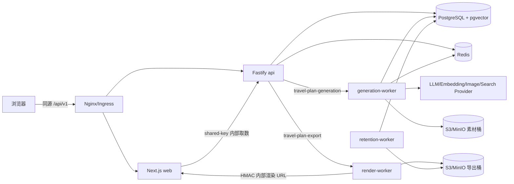

# 系统架构

## 一句话架构

这是一个契约驱动的 TypeScript 单仓库：Web 和 API 处理同步交互，两个独立 BullMQ 队列把计划生成与浏览器导出交给不同 Worker，PostgreSQL 保存领域数据和向量，S3/MinIO 保存图片与导出物，共享包承载所有可复用的纯逻辑。

## 运行时拓扑

浏览器只接触 Web 与 `/api/v1`。`/render/**` 和 `/internal/v1/**` 是内部链路，不是公网产品 API。

## 五个应用

| 应用                     | 责任                                                                                | 主要入口                                                                                               | 关键依赖/数据                                          |
| ------------------------ | ----------------------------------------------------------------------------------- | ------------------------------------------------------------------------------------------------------ | ------------------------------------------------------ |
| `apps/web`               | Planner V2.1 九步问卷/行前准备、账号与 CR 流水、计划详情、法律页、每日/完整渲染模板 | `src/app/page.tsx`、`src/app/credits/page.tsx`、`src/app/plans/[planId]/page.tsx`、`src/app/render/**` | API；`@tps/schemas`、`@tps/presentation`、字体与图标包 |
| `apps/api`               | HTTP、身份/配额/CR 闸门、标准化与冲突检查、幂等、入队、查询、取消、导出、内部取数   | `src/main.ts`、`src/server.ts`、`src/routes/*`                                                         | PostgreSQL、Redis、生成/导出队列、导出预签名           |
| `apps/generation-worker` | 历史检索、LLM 生成、规则校验与修复、计划版本保存、展示编排、素材解析                | `src/main.ts`、`src/generate-plan.ts`                                                                  | PostgreSQL、Redis、LLM/图像/图源、素材存储             |
| `apps/render-worker`     | 启动 Chromium，读取内部渲染页，做页面检查，输出 PNG/PDF 并上传                      | `src/main.ts`、`src/run-export.ts`                                                                     | Web 内部路由、导出队列、导出桶                         |
| `apps/retention-worker`  | 分批扫描到期匿名数据、先转存脱敏知识、删除对象、再级联删用户                        | `src/main.ts`、`src/purge.ts`                                                                          | PostgreSQL、导出桶                                     |

关键边界：

- `generation-worker` 不带 Chromium；`render-worker` 独立镜像，避免所有生成副本承担约 1GB 浏览器与字体体积。
- 计划生成与导出使用不同队列，消费者、资源画像和重试语义不同。
- Web 渲染路由不直连数据库，通过 API 内部展示端点取 ViewModel。
- AI 图片生成不是 API 路由；付费凭据、sharp 与对象写权限只进入生成 Worker。

## 十三个共享包

| 包                   | 定位                                                       | 代表文件/符号                                                                       | 主要消费者                     |
| -------------------- | ---------------------------------------------------------- | ----------------------------------------------------------------------------------- | ------------------------------ |
| `@tps/schemas`       | 五大契约、枚举、错误码、状态机、版本                       | `travel-request.ts`、`travel-plan.ts`、`view-model.ts`、`job-status.ts`             | 全部应用                       |
| `@tps/planning`      | 请求准备、N-01–N-12、V-xx 规则、两级修复、冲突与脱敏投影   | `prepare-request.ts`、`plan-rules.ts`、`resolve-plan.ts`、`retrieval-projection.ts` | API、生成 Worker               |
| `@tps/presentation`  | 内容压缩、派生字段、槽位、每日/完整 ViewModel              | `presentation-plan.ts`、`build-view-model.ts`、`build-full-plan.ts`                 | 生成 Worker、Web、渲染 Worker  |
| `@tps/assets`        | 评分、候选选择、缓存键、主题桶、SVG 路线图                 | `scoring.ts`、`selection.ts`、`cache-keys.ts`、`svg-map.ts`                         | API、生成 Worker               |
| `@tps/llm`           | LLM/Embedding/图片/搜索客户端、Prompt、候选故障转移        | `client.ts`、`prompt.ts`、`failover.ts`、`image.ts`、`image-search.ts`              | 生成 Worker                    |
| `@tps/billing`       | CR 换算、版本化价目、用量计量/计价、生成和导出估算         | `credits.ts`、`price-book.ts`、`usage.ts`、`estimate.ts`                            | API、生成/渲染 Worker、DB 测试 |
| `@tps/db`            | 连接池、迁移器、领域仓储、配置与模型池                     | `travel-plans.ts`、`assets.ts`、`users.ts`、`planner-config.ts`、`model-pools.ts`   | API、三个 Worker               |
| `@tps/queue`         | Redis 连接、生成/导出队列、素材锁、DLQ、Trace 透传         | `plan-queue.ts`、`export-queue.ts`、`asset-lock.ts`                                 | API、生成/渲染 Worker          |
| `@tps/storage`       | 素材公开存储、导出私有存储、15.4 内容键                    | `storage.ts`、`exports-storage.ts`、`content-keys.ts`                               | API、三个 Worker               |
| `@tps/shared`        | 配置、日志脱敏、身份令牌/密码/配额、幂等、UUIDv7、优雅停机 | `config.ts`、`logger.ts`、`identity/*`、`idempotency.ts`                            | 全部后端应用                   |
| `@tps/observability` | Prometheus 工厂/目录、标签白名单、OpenTelemetry            | `metrics.ts`、`catalog.ts`、`labels.ts`、`otel-sdk.ts`                              | 全部后端应用                   |
| `@tps/fonts`         | 自托管 Noto/Inter 字体、字符集与覆盖扫描                   | `src/*`、`scripts/build-fonts.mjs`                                                  | Web、镜像构建                  |
| `@tps/icon-library`  | 内嵌 SVG 图标并编译为 React 组件                           | `src/index.ts`、`src/svg/*`                                                         | Web                            |

依赖方向的核心规则是：应用可以依赖包，包不依赖应用；`schemas` 只依赖 Zod；有 IO 的编排留在应用，零 IO 的业务计算下沉共享包。

## 同步路径与异步路径

### 同步路径

- 身份解析、九步问卷投影、Schema 校验、请求标准化、输入冲突检查；
- 计费开启时查询发布价目、报价、余额预检与原子预留；
- 按用户和请求内容计算幂等键；
- 创建 `travel_requests`、`travel_plans`、`generation_jobs`；
- 将生成消息放入 Redis 队列；
- 查询任务、计划、展示数据、导出状态；
- 申请导出和签发下载 URL。
- 查询 CR 钱包、报价和流水；导出按固定价直接扣费、失败退款。

这些路径集中在 [`apps/api/src/routes`](../../apps/api/src/routes) 和 `@tps/db` 仓储。

### 异步路径

- 计划生成：[`apps/generation-worker/src/generate-plan.ts`](../../apps/generation-worker/src/generate-plan.ts)；
- 展示与素材：[`apps/generation-worker/src/presentation/build-presentation.ts`](../../apps/generation-worker/src/presentation/build-presentation.ts)；
- 导出：[`apps/render-worker/src/run-export.ts`](../../apps/render-worker/src/run-export.ts)；
- 保留期：[`apps/retention-worker/src/purge.ts`](../../apps/retention-worker/src/purge.ts)。

生成 Worker 同时计量 LLM token、embedding、图片生成/搜索等实际用量：计划可读时按预留锁定的价目版本结算，多预留部分退款；终态失败/取消释放预留，可重试失败等到最终结果再处理。

## 部署形态

| 场景         | 文件                                              | 说明                                               |
| ------------ | ------------------------------------------------- | -------------------------------------------------- |
| 本地基础设施 | `infrastructure/docker-compose.yml`               | PostgreSQL/pgvector、Redis、MinIO                  |
| 本地完整栈   | `deploy/mvp-apps.yml` + `deploy/local-proxy.yml`  | 五应用 + Nginx，入口为 `http://localhost:8080`     |
| 生产镜像     | `deploy/images/*.Dockerfile`                      | web、render-worker、通用 Node 服务镜像             |
| Kubernetes   | `deploy/helm/travel-poster`                       | 五组件、探针、资源、Secret 引用、render `/dev/shm` |
| 告警         | `deploy/prometheus/rules/travel-poster.rules.yml` | 与指标目录双向校验                                 |

## 架构不变量

1. 所有用户业务查询在 SQL 层携带 `user_id`；越权统一表现为 404。
2. `travel_plan_versions` 不覆盖旧版本，计划与展示按版本隔离。
3. 生成任务的进度单调不减，终态不可变。
4. 历史检索跨用户，但只能读取脱敏投影，不能读取 `plan_json`。
5. 图片来源必须可追踪；AI 景点图必须标为示意图。
6. 对象路径不是权限边界，下载授权以数据库当前归属为准。
7. 匿名归并只改数据库归属，不搬对象；清理禁止按 `anon/` 前缀粗暴删除。
8. 指标禁止高基数身份标签；用户/计划 ID 只进入脱敏日志与 Trace。
