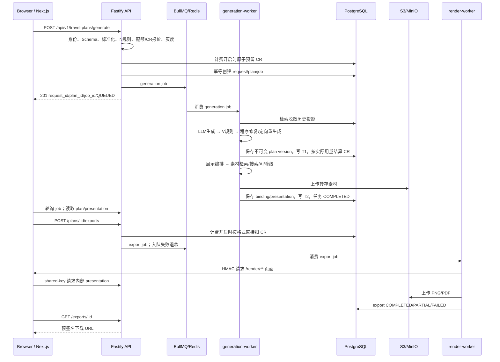

# 端到端主链路

> 本篇给「在哪、有什么」。生成链路上每个阈值具体是多少、顺序为何不能交换、越界后会怎样，
> 见 [专项说明：生成链路时序与判据](专项说明/生成链路时序与判据.md)。

## 从填写到下载

## 1. 前端构造请求

入口是 [`Planner.tsx`](../../apps/web/src/components/planner/Planner.tsx)。当前是 Planner V2.1：9 步主问卷、76 个字段，生成后另有第 10 个“行前准备中心”。字段元数据在 [`planner-fields.ts`](../../packages/schemas/src/planner-fields.ts)，状态/触发/校验分别在 [`state.ts`](../../apps/web/src/lib/planner/state.ts)、[`triggers.ts`](../../apps/web/src/lib/planner/triggers.ts)、[`validation.ts`](../../apps/web/src/lib/planner/validation.ts)，最终由 [`buildPlannerRequest`](../../apps/web/src/lib/planner/request.ts) 投影为兼容的 `TravelRequestUI`。

关键点：

- `client_request_id` 每次新的生成意图都要重新生成；重复提交同一个 ID 才能命中幂等；
- 76 个答案逐字保存在可选 `planner_profile`，路径恒为 `planner_profile.{api_key}`；同时投影到 P8 核心字段与 `conditions[]`，保持旧客户端兼容；
- 条件是三态：偏好=`SHOULD,true`，必须=`MUST,true`，不要=`MUST,false`；
- 核心兼容契约仍有 11 个真正必填字段，V2 UI 负责从问卷答案构造它们；
- 规划器可选项优先读取 `GET /api/v1/planner/config`，失败才回退代码内置值；
- 支持 1～5 个目的地、0～30 天弹性信息和 CNY/JPY/USD/EUR/GBP/HKD；首目的地必须与旧 `trip.destination` 一致；
- localStorage 草稿带结构版本，只在当前设备恢复；高敏字段在摘要栏只显示抽象说明；
- 计费开启时生成按钮调用 `/credits/quote` 显示典型/上界/预留 CR，余额不足直接禁用。

## 2. API 同步接收

[`registerTravelPlanRoutes`](../../apps/api/src/routes/travel-plans.ts) 的生成端点按顺序完成：

| 步骤                  | 实现位置                                                       | 失败表现                              |
| --------------------- | -------------------------------------------------------------- | ------------------------------------- |
| 身份解析              | `routes/identity-context.ts`、`identity/service.ts`            | 默认匿名关闭时无会话返回 401          |
| 功能开关              | `feature-gate.ts`、`@tps/shared/feature-flags.ts`              | `SYS_FEATURE_DISABLED` / 503          |
| Zod 请求解析          | `TravelRequestUISchema`                                        | `REQ_SCHEMA_INVALID`                  |
| 标准化                | `@tps/planning/prepare-request.ts`、`normalize.ts`             | 生成 `NormalizedTravelRequest`        |
| N-01–N-12 冲突检查    | `@tps/planning/conflicts.ts`                                   | 4xx，任务不入队                       |
| 配额与 IP 防刷        | `@tps/shared/identity/quota-guard.ts`                          | 429 + `Retry-After`                   |
| CR 预检与预留（可选） | `apps/api/src/credits/service.ts` + `@tps/db/credit-wallet.ts` | 不足返回 402；原子冻结 `credit_holds` |
| 幂等                  | `@tps/shared/idempotency.ts` + Redis SETNX + DB 唯一约束       | 同用户同请求返回原任务                |
| 持久化与入队          | `@tps/db/travel-plans.ts` + `@tps/queue/plan-queue.ts`         | 创建 request/plan/job 后返回 201      |

幂等键包含 `user_id`，所以不同用户提交相同需求不会互相复用。Redis 负责快速并发去重，数据库唯一约束是最终防线。

## 3. 生成 Worker 状态推进

主编排是 [`generatePlan`](../../apps/generation-worker/src/generate-plan.ts)。状态和显示进度的单一真相源是 [`packages/schemas/src/job-status.ts`](../../packages/schemas/src/job-status.ts)。

| 状态                    |  进度 | 实际工作                                          | 代码                                             |
| ----------------------- | ----: | ------------------------------------------------- | ------------------------------------------------ |
| `QUEUED`                |     0 | 等待队列；超过 600 秒不再浪费模型成本             | `job-deadline.ts`、`generate-plan.ts`            |
| `NORMALIZING`           |     4 | 读回并校验 API 已保存的标准化请求                 | `generate-plan.ts`                               |
| `VALIDATING_REQUEST`    |     8 | 只推进状态，不重跑随日期变化的 N 规则             | `generate-plan.ts`                               |
| `RETRIEVING_REFERENCES` |    14 | 跨用户检索脱敏历史计划/知识                       | `retrieval.ts`、`@tps/db/retrieval.ts`           |
| `GENERATING_PLAN`       |    20 | 选择 tier 对应候选模型，按天数分段调用            | `@tps/llm/prompt.ts`、`client.ts`、`failover.ts` |
| `VALIDATING_PLAN`       |    48 | Zod + V-01–V-45 业务规则                          | `@tps/planning/plan-rules.ts`                    |
| `REPAIRING_PLAN`        |    54 | 最多 3 轮程序修复、2 次 LLM 定向重生成            | `repair-plan.ts`、`resolve-plan.ts`              |
| `SAVING_PLAN`           |    60 | UUIDv7 版本、投影、向量、计划 JSON 同事务保存；T1 | `generate-plan.ts`、`@tps/db/travel-plans.ts`    |
| `BUILDING_PRESENTATION` |    66 | 建 N 个每日页 + 1 个完整页、派生字段和槽位        | `build-presentation.ts`、`@tps/presentation`     |
| `RESOLVING_ASSETS`      |    76 | 图标、地图、图库、联网搜索、AI 与占位降级；T2     | `assets/resolve-assets.ts`                       |
| `GENERATING_ASSETS`     |    82 | 状态机保留的 AI 回边；实际素材编排在解析链内部    | `job-status.ts`、素材 resolver                   |
| `RENDERING_HTML`        |    90 | 确认 ViewModel 和必需槽位可渲染，不保存 HTML 快照 | `generate-plan.ts`                               |
| `EXPORTING_*`           | 94/97 | 状态机支持，但用户导出在独立 `exports` 任务中     | `job-status.ts`、render-worker                   |
| `COMPLETED`             |   100 | 计划与展示已就绪                                  | `generate-plan.ts`                               |

只有两条合法回边：`REPAIRING_PLAN → VALIDATING_PLAN`、`GENERATING_ASSETS → RESOLVING_ASSETS`。进度取 `max(current,next)`，所以回边不会让前端进度倒退。

## 4. LLM、检索与修复

生成前，Worker 用目的地、天数范围和请求向量检索最多 5 条参考。检索来源包括仍在用户表下的 `travel_plan_versions` 与匿名清理后留下的 `plan_knowledge`。超时 1.5 秒或无匹配不会阻断，计划的 `assumptions` 会记录“无历史参考”。

LLM 输出先过 `TravelPlanLlmOutputSchema`，Worker 再注入 ID、Schema 版本与状态。规则失败后：

1. 程序化修复确定性问题，最多 3 轮；
2. 仍不满足时，把具体 `rule/path/detail` 发给 LLM 定向重生成，最多 2 次；
3. 收敛后为 `READY` 或 `REPAIRED`；不收敛则版本以 `REJECTED` 保存用于排查，但不会成为 `current_version_id`，任务转 `FAILED`。

## 5. 展示编排与素材解析

[`buildAndSavePresentations`](../../apps/generation-worker/src/presentation/build-presentation.ts) 把领域计划转换为模板友好的 ViewModel：

- 每天生成一个 `DAILY_POSTER`，全程生成一个 `FULL_PLAN`；
- 完整页复用每日素材槽位，不重复制造需求；
- `derive.ts` 生成日期标签、公里数、预算项等派生字段；
- `compact.ts` 执行 L0–L2 确定性文案压缩；
- `requirements.ts`/`slots.ts` 产生稳定槽位 ID；
- `build-view-model.ts` 把素材解析结果注入每日页；
- `build-full-plan.ts` 聚合完整计划页。

素材解析的实际优先级由 [`resolve-assets.ts`](../../apps/generation-worker/src/assets/resolve-assets.ts) 按角色选择：

| 角色   | 主路径                             | 到底降级                   |
| ------ | ---------------------------------- | -------------------------- |
| 图标   | 内嵌 `@tps/icon-library` React SVG | 无网络请求，加载失败应为 0 |
| 路线图 | 程序生成 SVG schematic             | 节点不足/失败时文字路线    |
| Hero   | 预制/缓存 → 本地库 → 授权搜索 → AI | 渐变背景                   |
| 景点图 | 本地库 → 授权搜索 → AI             | 默认占位图                 |
| 美食图 | 本地库 → 授权搜索 → AI             | 默认占位图                 |

搜索命中会自动下载、校验 MIME/分辨率/授权、后处理、计算指纹与标签并集、转存和入库，下一次优先从本地库命中。非阻断失败进入 `generation_jobs.warnings`，不会把可用的文字计划变成失败。

## 6. T1、T2、T3 分段可用

| 里程碑 | 用户可用内容              | 数据判定                                | 前端行为                       |
| ------ | ------------------------- | --------------------------------------- | ------------------------------ |
| T1     | 完整文字计划              | `t1_at` 已写；`current_version_id` 可读 | 无需等待任务 100%，可请求 13.3 |
| T2     | 带素材的每日/完整展示数据 | `t2_at` 已写；presentation 已保存       | 切换信息图/详情展示            |
| T3     | PNG/PDF                   | 独立 export 进入终态                    | 展示预签名下载链接             |

里程碑总耗时包含排队时间。数据库计算已排队时长，Worker 只在自己的单调计时域内做加法，避免数据库时钟与进程时钟相减产生负数。

## 7. 导出链路

1. `POST /api/v1/travel-plans/:plan_id/exports` 校验计划归属、版本匹配、格式、配额与 CR 余额；
2. `exports.idempotency_key` 保证重复申请返回原 `export_id`；
3. 计费开启时按 PNG/PDF 固定 SKU 直接扣 CR；随后消息进入独立 `travel-plan-export` 队列，入队失败立即退款；
4. [`runExport`](../../apps/render-worker/src/run-export.ts) 计算需要的页面；
5. Render Worker 签发短期 HMAC 令牌访问 Web 的 `/render/plans/...`；
6. Web 中间件校验令牌，再用内部共享密钥从 API 获取 ViewModel；
7. Playwright 等待 `window.__RENDER_READY__`，检查字体、图片和溢出；
8. PNG 用截图生成；PDF 按可打印宽度缩放，必要时用 pdf-lib 合并；
9. 文件按内容空间键上传，`exports.files[]` 保存真实 `storage_key`；
10. 查询端点按当前数据库归属签发 7 天 URL，不重渲染；渲染最终失败时 render-worker 退款。

某些页面失败时导出可为 `PARTIAL`；生成任务本身不会因为用户后续导出失败而倒退。

## 8. CR 计费生命周期

计费总开关默认关闭；关闭时三个进程完全不触碰钱包表。打开后：

1. API 从发布价目表估算典型与上界用量，按 `CREDIT_HOLD_BUFFER_PERCENT` 计算预留；
2. 余额预检用于给出友好 402，但真正防并发超发的是数据库事务内 `reserve`；
3. `credit_wallets.held_cr` 冻结，`credit_holds` 记录 job、金额、过期时间和锁定价目版本；
4. `UsageMeter` 统计 base fee、LLM 输入/输出 token、embedding、图片生成/搜索等；
5. 计划 `saved` 时结算，实际少于预留则退差额；拒绝、不可重试失败、取消则释放；
6. 可重试失败不立即释放，避免下一次尝试没有预留；重试耗尽由 Worker main 释放；
7. 实际成本超过预留时不把钱包扣成负数，差额记 `WRITE_OFF` 坏账；
8. 账本用幂等键保证重复结算/退款不重复记账。

详细口径见 [用户货币与计费](../用户货币与计费.md)。

## 9. 取消、重试和降级

- `POST /api/v1/generation-jobs/:job_id/cancel` 把非终态任务置 `CANCELLED`；Worker 在阶段边界检查并停止。
- 队列重复投递时，Worker 发现终态后直接跳过。
- BullMQ、Worker、客户端和不可重试错误构成四层重试策略；硬约束不满足不消耗无意义的队列重试。
- 整任务上限 300 秒，排队上限 600 秒；完成的计划不会因保存前刚好超时而被丢弃。
- 素材、历史检索和向量化均可降级；模板核心结构、计划持久化等才是阻断错误。
