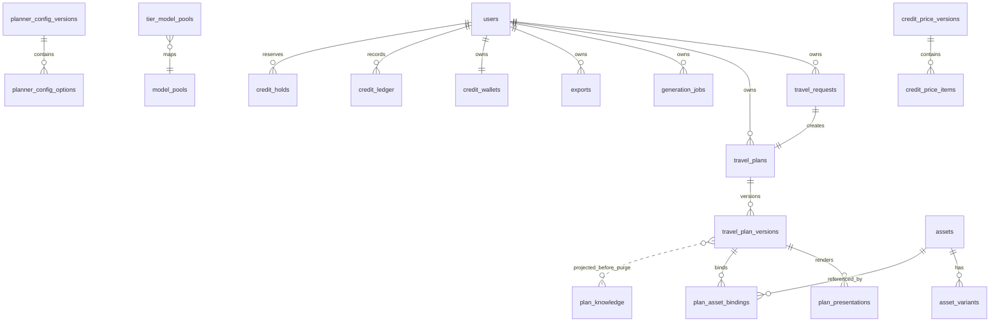

# 数据、检索与存储

## 数据关系总览



`plan_knowledge` 没有 `user_id`，不是普通外键关系；它保存匿名数据删除前的脱敏知识。`travel_plans.current_version_id` 指向当前可展示版本，但版本行本身永不覆盖。

## 迁移时间线

数据库迁移只前向，执行器记录 SHA 校验和并用 advisory lock 防并发。已应用文件不可修改。

| 迁移                                 | 引入内容                                             | 代码消费者                                                    |
| ------------------------------------ | ---------------------------------------------------- | ------------------------------------------------------------- |
| `0001_extensions`                    | `pgcrypto`、`vector`、`citext`                       | 全部仓储、向量检索                                            |
| `0002_users`                         | 匿名/注册统一 `users`、状态/配额/过期与约束          | `db/users.ts`、API IdentityService                            |
| `0003_travel_plans`                  | request/plan/version/job/export/knowledge、检索角色  | `db/travel-plans.ts`、`retrieval.ts`、`exports.ts`、retention |
| `0004_retrieval_role_membership`     | 将运行角色纳入只读检索角色                           | `db/retrieval.ts`                                             |
| `0005_assets`                        | assets、variants、bindings、presentations            | `db/assets.ts`、`presentations.ts`、生成 Worker               |
| `0006_job_milestones`                | `generation_jobs.t1_at/t2_at` 与索引                 | 生成 Worker、状态 API、SLA 指标                               |
| `0007_asset_content_hash`            | 字节内容指纹与部分唯一索引                           | 搜索入库去重                                                  |
| `0008_asset_source_metadata`         | 授权图源的可审计来源元数据与对称约束                 | `search-ingest.ts`                                            |
| `0009_model_pools`                   | 用户 tier、LLM/IMAGE 候选池与 tier 映射              | `db/model-pools.ts`、两个运维 CLI                             |
| `0010_phone_auth_and_planner_config` | 手机账号、规划器版本/选项/视图/发布函数              | auth、planner config API/Web                                  |
| `0011_planner_v2_config`             | P9 新条件码与配置版本 2                              | Planner V2.1、API 白名单                                      |
| `0012_planner_config_all_options`    | 九步问卷全部选项，配置版本 3，field key 对齐载荷路径 | config binding、通用控件、coverage tests                      |
| `0013_credit_wallet`                 | 钱包、只追加流水、预留、版本化价目与视图             | `@tps/billing`、credits service、API/Worker                   |
| `0014_dev_prices`                    | 开发期可运行定价版本 2                               | 本地/内测报价与计费；仍是待产品确认的占位价                   |
| `0015_require_destination`           | 克隆当前配置并停用“目的地完全没定”                   | Planner 前端选项、目的地必填规则                              |

## 核心表到代码

| 表                            | 保存什么                                                          | 写入者                               | 读取者/仓储                                 |
| ----------------------------- | ----------------------------------------------------------------- | ------------------------------------ | ------------------------------------------- |
| `users`                       | 身份类型、邮箱/手机、密码哈希、匿名 token、tier、配额覆写、保留期 | IdentityService、tier CLI、retention | `packages/db/src/users.ts`、`tier-admin.ts` |
| `travel_requests`             | 原请求、标准化请求、用户级幂等键                                  | API generate                         | `db/travel-plans.ts`、生成 Worker上下文     |
| `travel_plans`                | 计划聚合根、当前版本、标题、状态                                  | API 创建；Worker更新当前版本         | `db/travel-plans.ts`                        |
| `travel_plan_versions`        | 不可变计划 JSON、约束报告、脱敏投影、向量、模型元数据             | generation-worker                    | 计划读取、检索、presentation                |
| `generation_jobs`             | 状态、进度、消息、警告、错误、阶段耗时、T1/T2                     | API创建；Worker推进；取消端点        | 任务轮询、指标、CLI                         |
| `exports`                     | 导出意图、版本、状态、文件 `storage_key`、幂等                    | API创建；render-worker完成           | `db/exports.ts`、API预签名、retention       |
| `plan_knowledge`              | 无身份的检索投影和向量                                            | retention清理前转存                  | 全局检索                                    |
| `assets`                      | 图片/SVG元数据、来源、授权、向量、质量、缓存键、hash              | 灌库/搜索/AI/地图链路                | `db/assets.ts`、local-library               |
| `asset_variants`              | WebP/缩略图等变体                                                 | 图片后处理                           | presentation/资产读取                       |
| `plan_asset_bindings`         | 版本槽位到 asset、策略、分数、fallback level                      | presentation素材编排                 | 展示追溯与分析                              |
| `plan_presentations`          | 每日/完整 ViewModel、槽位与 validation status                     | generation-worker                    | 公网/内部展示端点                           |
| `model_pools`                 | LLM/IMAGE 候选配置、顺序、超时与启用状态                          | `model:pool` CLI                     | generation-worker 60秒缓存                  |
| `tier_model_pools`            | 用户 tier 到池的区间/回退映射                                     | `model:pool` CLI                     | `resolveCandidates`                         |
| `planner_config_*`            | 前端选项发布版本与内容                                            | SQL clone/edit/publish               | planner-config repository/API               |
| `credit_wallets`              | 当前可用余额与冻结额，非负整数 CR                                 | 注册赠送/运营授予/预留/结算          | `db/credit-wallet.ts`、credits API          |
| `credit_ledger`               | `TOPUP/GRANT/SPEND/REFUND/WRITE_OFF/ADJUST` 只追加流水            | 钱包事务                             | 用户流水页、运营审计                        |
| `credit_holds`                | 生成任务预留、锁定价目版本、ACTIVE/SETTLED/RELEASED/EXPIRED       | API reserve；Worker settle/release   | 计费恢复与幂等                              |
| `credit_price_versions/items` | 按 SKU 和单位定价的发布版本                                       | SQL clone/edit/publish               | API 60 秒价目缓存、Worker按锁定版本结算     |

## 所有权与隔离

用户拥有的业务表均在建表时带 `user_id NOT NULL REFERENCES users(id) ON DELETE CASCADE`。仓储查询不接受“先按 ID 查出后再在应用层比用户”的写法，而是在 SQL 中同时使用资源 ID 与 `user_id`。

为什么越权返回 404：如果 403，攻击者可以通过差异确认某个 plan/export/job ID 存在。路由和 `test:isolation` 覆盖匿名 A↔匿名 B、匿名↔注册等矩阵。

`plan_asset_bindings.asset_id` 使用 `ON DELETE RESTRICT`，保证历史绑定的素材追溯不会因资产误删消失；素材下架用 `status`，不是物理删除。

## 全局历史检索为何不泄露用户数据

检索是跨用户的，但经过四层限制：

1. [`buildRetrievalProjection`](../../packages/planning/src/retrieval-projection.ts) 逐字段只保留可复用的目的地知识、行程结构、公共 POI/交通/餐饮建议；剔除日期、金额、人员组成、自由文本、ID、约束报告等。
2. `plan_embedding` 只根据投影文本生成，不根据完整 `plan_json`。
3. [`packages/db/src/retrieval.ts`](../../packages/db/src/retrieval.ts) 的返回类型不包含 `plan_json`。
4. 数据库角色 `travel_retrieval_ro` 只有列级权限，直接 `SELECT plan_json` 会被拒绝。

查询过滤：同 `destination_place_id`、天数相差不超过 3、排除当前计划和 `REJECTED`、余弦相似度至少 0.75、合并两个来源后 Top 5，整体 1.5 秒上限。

本地 `fake` 模式的哈希向量只反映词汇重合，命中率不代表真实语义向量效果。切换真实 embedding 模型后必须重算存量向量；不同向量空间不可比较。

## 素材检索与去重

`assets` 的候选检索先按目的地/实体/角色等维度预过滤，再取 Top 30 评分。全为空的预过滤条件刻意返回 0，防止全表扫描。评分由 `@tps/assets/scoring.ts` 的相关性、目的地、实体、风格、构图、质量等子函数组合；最高分 ≥0.80 可早退，最终低于 0.65 视为未命中，预算 800ms。

搜索图入库：

```text
授权图源搜索
→ 下载并验证 MIME/分辨率
→ license_type 非空门禁
→ 用 AssetRequirement 上下文打标
→ sharp 统一后处理
→ embedding + quality_score（<0.3 不入库）
→ SHA-256 content_hash 精确去重
→ 新建 asset 或合并 style_tags/search_text
```

这里只做字节级去重，不做感知哈希。错把相似但不同的地标合并会张冠李戴，风险大于多存一张图。

## 对象存储

### 两种桶/访问策略

| 存储类            | 内容               | 访问                           | 实现                                      |
| ----------------- | ------------------ | ------------------------------ | ----------------------------------------- |
| `S3ObjectStorage` | 页面长期引用的素材 | 稳定公开 URL + immutable cache | `packages/storage/src/storage.ts`         |
| `S3ExportStorage` | 私人 PNG/PDF       | 私有对象 + 7 天预签名 URL      | `packages/storage/src/exports-storage.ts` |

二者不能合并：素材若使用短期签名，一周后历史页面全部裂图；导出若公开，拿到 URL 的人可永久下载私人行程。

### 内容空间键

`travel_plan_versions.id` 是 UUIDv7 `content_id`，也是日志、Trace、展示、绑定和导出物的共同锚点。

```text
注册用户：users/{user_id}/{yyyyMM}/{content_id}/exports/{export_id}/{file}
匿名空间：anon/{yyyyMM}/{content_id}/exports/{export_id}/{file}
```

构造器是 [`contentPrefix`](../../packages/storage/src/content-keys.ts) 与 `exportObjectKeyFor`。UUIDv7 从 ID 派生 `yyyyMM`；历史非 v7 ID 才回退 `created_at`。不要在调用点手拼键。

对象路径不代表归属：匿名注册/归并后旧文件仍在 `anon/`，数据库的 `user_id` 已变。API 先查数据库归属，再对 `exports.files[].storage_key` 预签名。

## 保留期与删除顺序

匿名入口默认关闭，但保留实现和存量数据处理仍有效。到期清理由 [`runPurgeRound`](../../apps/retention-worker/src/purge.ts) 分批执行：

1. 查 `users_anon_expiry_idx`，最多 500 个到期匿名用户；
2. 把可用版本的 `retrieval_projection + embedding` 写入无身份的 `plan_knowledge`；
3. 从 `exports.files[].storage_key` 取得真实对象键并删除对象；
4. 任一必需转存/对象删除失败，则保留用户行供重试；
5. 成功后删除 `users`，由 FK 级联删除用户业务数据。

禁止按 `anon/` 前缀整体清理，因为其中可能包含已经归并到注册用户但不搬运的长期数据。

已知缺口：匿名期导出后又注册/归并的用户，其遗留在 `anon/` 下的导出物尚未按 `exports.created_at` 实现 90 天到期扫描；详见 [实施状态与已知边界](07-实施状态与已知边界.md)。

## 数据库改动规则

- 新迁移追加下一个编号，不修改已应用 SQL；
- 不写 down migration；破坏性变更走 expand → backfill → contract；
- 新业务表在创建时加入用户归属和级联策略；
- CHECK 条件涉及 NULL 时避免依赖 SQL 三值逻辑，优先显式 `CASE`；
- 迁移后同时更新 `@tps/db` 类型/仓储、fake 仓储、集成测试、数据 Wiki；
- 用 `pnpm db:migrate` 后重复执行一次并用 `pnpm db:status` 检查漂移。

## CR 钱包一致性

CR 全程使用整数，人民币换算由 `CREDIT_CR_PER_CNY` 控制；修改比率会改变全部存量余额的人民币含义，不能作为普通调参。供应商用量通过版本化 SKU 定价，模型 SKU 必须有 `:*` 兜底。

钱不放 Redis：余额、冻结和流水需要 PostgreSQL 事务与约束保证并发一致性。关键操作均幂等：

- `reserve` 在锁钱包行后同时检查可用余额、增加 `held_cr`、创建 job 唯一 hold；
- `settle` 必须使用 hold 锁定的 price version，而不是当前新发布版本；
- 多预留退款、失败释放和导出退款各用稳定 ledger idempotency key；
- 实际费用超过预留的差额记 0 金额 `WRITE_OFF` 元数据，不允许把余额扣负；
- 钱包是当前状态真相，ledger 是不可变审计真相，两者都由集成测试验证。

计费总开关关闭时应用不创建仓储、不注册端点，也不查询 0013 表，使尚未迁移的钱包部署仍可运行。详细操作见 [用户货币与计费](../用户货币与计费.md)。
